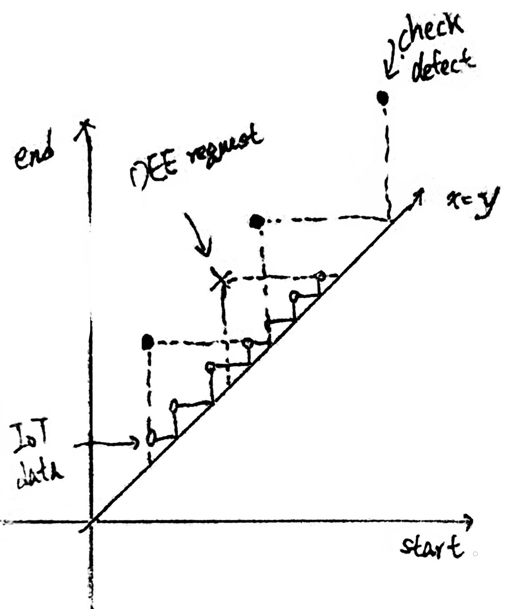

後端模組化需求:
===
[toc]

## OEE formula
 * OEE = Availability * Performance * Quality
 * Availability = Run Time / Planned Production Time
 * Performance = Total Count / ( Run Time / Ideal Cycle Time )
 * Quality = (Total Count - Defect Count) / Total Count

### note:
 1. Total Count = (injection count) * cavity
 2. Run Time = Planned Production Time - Down Time
 3. need to get Total Count
 4. need to get Defect Count
 5. need to get Ideal Cycle Time

-------------------------------------------

## config 參數
    1. name:OEE
    2. OEE_by_OWN: true
    3. OEE_by_Scheduling: false //update total count by scheduling
    4. default_cavity: 1
    5. default_ideal_cycle_time: 10
    6. default_planned_production_time: 100%
##  Requirement
    1. task to update db table
##  self data models
    1.  IoT_record
        1. timestamp
        2. machine
        3. mold // able to get cavity
        4. counter // able to get total count
    2.  defect_record
        1. start_time
        2. end_time
        3. defect_count
   
##  task functions (check, summary, backup)
    1. check_OEE_by_day()
    2. check_availability_by_day()
    3. summary_OEE_by_day()
    4. summary_availability_by_day()
    5. backup_OEE_by_day()
    6.  backup_availability_by_day()
##  API route
    1. /api/availability/
    2. /api/OEE/
##  internal methods (friendly use for engineer)
    1. get_availability_by_time(machine, start_time, end_time)
    2. get_OEE_by_time(machine, start_time, end_time)
##  relative data sources
    1. relative db table
    2. from internal methods
    3. external api
##  連動其他 module 行為
    1. work order api
    2. scheduling api
    3. alert api
## OEE challenge description
</img>
   1.  the `x-axis` is the start time, the `y-axis` is the end time
   2.  the point on the graph means a time period (start from x end to y)
   3.  the `black dot (defect point)` is the inventory event and will get the number of defect at the point
   4.  the `white dot (iot point)` is the number of total count at the point
   5.  the `cross_mark` is the OEE request, and OEE module should able to return the OEE value

**Challenge:** the `cross_mark` almost not to fit `defect points` and `iot points`, then the `OEE value` will be a _estimated value_ cannot be a _accurate value_

