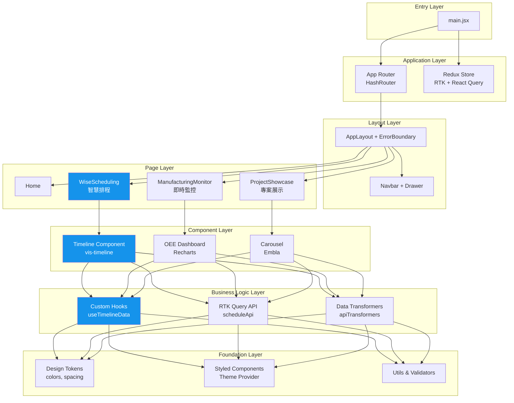

# Harry's Frontend Engineering Portfolio - 前端工程師作品集

> 整合智慧製造排程、即時監控與資料視覺化的工業級前端解決方案

🔗 **線上展示**: <harry.intelligentfire.dpdns.org>

---

## 💡 核心亮點

🚀 **優化部署策略 — 雙平台 CI/CD 架構** → 從 GitHub Pages 遷移至 Cloudflare Pages，實現全球 CDN 加速部署，並保持雙平台兼容性。透過環境變數區分建置模式（`build` / `build:gh-pages`），展現 DevOps 思維與 CI/CD 實戰能力

🔥 **4 種狀態管理方案並存整合** → Redux Toolkit、RTK Query、React Query、Zustand 混合使用，展示複雜狀態管理架構能力

🏭 **工業級甘特圖實作** → vis-timeline 處理 1000+ 排程項目，使用 `useRef` + DataSet API 避免重渲染，實現流暢拖拽體驗

🎨 **完整 Design Tokens 系統** → 8px 基線網格 + 主題化 + 統一色彩系統，可維護性與一致性兼具

⚡ **多層次效能優化** → Code Splitting、Lazy Loading、useRef 避免昂貴重渲染、Memoization 策略

📊 **複雜資料視覺化** → OEE 監控儀表板、Recharts 圖表整合、即時資料更新、多區域生產監控

🧩 **分層 Custom Hooks 架構** → 資料層 → 業務邏輯層 → UI 交互層，清晰的關注點分離

---

## 🚀 核心技術棧

### 前端框架與工具

- **React 18.3.1** - Hooks、Concurrent Features
- **Vite** - 快速開發伺服器與構建工具
- **React Router v6** - Browser 路由（現代化 URL 結構）

### 狀態管理

- **Redux Toolkit** - 全局狀態管理
- **RTK Query** - API 資料獲取與快取
- **TanStack Query (React Query)** - 伺服器狀態管理
- **Zustand** - 輕量級狀態管理

### UI 框架與樣式

- **Material-UI (MUI)** - 複雜 UI 組件（Dialog、Table、DatePicker）
- **Ant Design** - 部分進階組件(專案合併兼容)
- **Styled Components** - CSS-in-JS 主題系統
- **Design Tokens** - 統一設計語言（顏色、間距、字體）

### 資料視覺化

- **vis-timeline** - 工業級甘特圖／時間軸
- **Recharts** - 圖表視覺化
- **vis-data DataSet** - 響應式資料結構

### 表單與驗證

- **React Hook Form** - 高效能表單管理
- **Zod** - TypeScript-first 結構驗證

### 其他核心庫

- **Day.js** - 日期時間處理
- **Embla Carousel** - 輪播組件
- **Iconify** - 圖標系統
- **React Markdown** - Markdown 渲染

---

## 📦 專案展示

### 1. 智慧排程系統（WiseScheduling）

**技術重點**: vis-timeline、RTK Query、Custom Hooks、複雜狀態管理

**功能**:

- 多區域生產排程管理
- 拖拽式甘特圖操作
- 機台狀態即時監控
- 工單調度與歷史記錄
- 時間範圍動態切換（小時/天/週/月）

**核心實作**:

- 使用 `useRef` 避免 vis-timeline 重新初始化
- 自訂 Hook 分層架構（資料層 → 業務邏輯層 → UI 交互層）
- DataSet API 直接更新避免 React 重渲染

### 2. 製造現場即時監控（ManufacturingLiveMonitor）

**技術重點**: Recharts、OEE 計算、即時資料更新

**功能**:

- OEE（設備綜合效率）儀表板
- 多區域生產監控
- 即時數據視覺化
- 生產良率分析

### 3. 專案展示系統（ProjectShowcase）

**技術重點**: Embla Carousel、六角網格佈局、動態路由

**功能**:

- 垂直輪播展示專案
- 響應式六角形卡片網格
- Markdown 專案詳情渲染
- 技術標籤分類

### 4. Design Token 系統

**技術重點**: Design System、主題化、可維護性

**實作**:

- 統一色彩系統（primary、accent、functional colors）
- 8px 基線網格間距系統
- 字體階層與排版規範
- 邊框、陰影、過渡效果標準化

---

## 🏗️ 架構設計

### 系統架構圖



### 目錄結構

```text
src/
├── components/                    # 可複用組件
│   ├── WiseScheduling/           # 🏭 智慧排程系統（最複雜模組）
│   │   ├── components/           #   - Schedule, MachineStatus, Dialogs
│   │   ├── hooks/                #   - useTimelineData, useMachineStatus
│   │   ├── utils/                #   - transformers, validators, dateUtils
│   │   ├── services/             #   - RTK Query API slices
│   │   └── configs/              #   - constants, validations
│   ├── ManufacturingLiveMonitor/ # 📊 即時監控儀表板
│   ├── ProjectCarousel/          # 🎠 垂直輪播組件
│   ├── ShowcaseGallery/          # 🎨 專案展示畫廊
│   ├── Navbar/                   # 🧭 響應式導航列
│   └── HamburgerMenu/            # 🍔 動畫漢堡選單
├── page/                         # 路由頁面組件
│   ├── Home.jsx                  # 首頁
│   ├── Timeline.jsx              # 時間軸展示
│   ├── ProjectShowcase.jsx       # 專案集錦
│   └── About.jsx                 # 關於頁面
├── hooks/                        # 全局自訂 Hooks
│   ├── useNavbarSelector.js      # Navbar 選擇器動畫
│   └── usePageTitle.js           # 動態頁面標題
├── store/                        # Redux 配置
│   └── store.js                  # Redux Toolkit store
├── services/                     # API 服務基礎配置
│   └── apiSlice.js               # RTK Query base
├── designTokens/                 # 🎨 Design System Tokens
│   ├── colors.js                 # 色彩系統
│   ├── spacing.js                # 8px 基線網格
│   ├── typography.js             # 字體階層
│   └── effects.js                # 陰影、過渡效果
├── layouts/                      # 佈局組件
│   └── AppLayout.jsx             # Error Boundary + Navbar
├── styles/                       # 全局樣式
│   └── SharedStyles.js           # 響應式斷點、mixins
└── constants/                    # 常量配置
```

### 關鍵設計模式

#### 1. Custom Hooks 分層

```javascript
// 資料層
useAreaScheduleData(area, startTime, endTime)

// 業務邏輯層
useTimelineData(machines, schedules)
useTimelineConfig(items, timeRange)

// UI 交互層
useMoveToNowHandler(timelineRef)
```

#### 2. Compound Components

複雜組件拆分為子組件，保持單一職責

#### 3. Render Props & HOC

- Error Boundary 包裝路由
- Layout 層級共享邏輯

#### 4. State Colocation

狀態盡可能靠近使用處，全局狀態最小化

#### 5. Data Transformation Pipeline

```text
Raw API Data
  → transformScheduleData()
  → vis-timeline Format
  → DataSet.add()
  → Display
```

---

## 🎨 UI/UX 特色

- **響應式設計**: 完整支援桌面、平板、手機
- **暗色主題**: 專業工業風格配色
- **動畫過渡**: Smooth CSS transitions
- **無障礙**: ARIA labels、鍵盤導航
- **效能優化**: Code splitting、Lazy loading

---

## 🛠️ 開發工具

```bash
# 開發
npm run dev

# 構建
npm run build

# 預覽構建結果
npm run preview

# Lint 檢查
npm run lint

# Conventional Commits
npx cz
```

---

## 📝 代碼品質

- **JSDoc 文檔**: 完整的函數與組件註解
- **四層結構註解**: Setup → Types → Core → Utilities
- **ESLint**: 代碼規範檢查
- **Conventional Commits**: 語義化提交訊息
- **Self-Documenting Code**: 清晰的命名與結構

---

## 🌐 部署策略：從 GitHub Pages 到 Cloudflare Pages

### 🔥 遷移亮點：追求極致效能的技術決策

在專案初期使用 GitHub Pages + GitHub Actions 部署，後主動遷移至 Cloudflare Pages，展現以下技術能力：

#### 1. **效能導向思維 (Performance-Driven)**

- **全球 CDN 加速**: Cloudflare 擁有全球頂尖的 CDN 網路，顯著降低 TTFB (Time To First Byte)
- **邊緣運算優化**: 用戶從最近的邊緣節點存取，提升載入速度
- **自動優化**: 針對 Vite + React 專案的建置流程優化

#### 2. **解決真實 CI/CD 問題**

遷移過程中解決的關鍵技術挑戰：

##### 問題 1: 環境不一致

```bash
# 解決方案：統一使用 npm，確保套件版本一致
npm ci --legacy-peer-deps
```

##### 問題 2: 路徑配置錯誤 (404 錯誤)

```javascript
// vite.config.js - 雙平台兼容方案
export default defineConfig(({ mode }) => {
  const base =
    mode === 'github-pages'
      ? '/React-WiseScheduling_TimeLine_Library/' // GitHub Pages 子路徑
      : '/' // Cloudflare Pages 根路徑

  return { base /* ... */ }
})
```

##### 問題 3: 動態導入模組失敗

- 診斷: Hash 路由不適用於 Cloudflare Pages
- 解決: 改用 `createBrowserRouter` 獲得更乾淨的 URL 結構
- 移除: GitHub Pages 專用的路由重定向腳本

#### 3. **雙平台部署架構**

**建置指令**:

```bash
npm run build           # Cloudflare Pages (預設)
npm run build:gh-pages  # GitHub Pages (保留兼容性)
```

**GitHub Actions 工作流**:

```yaml
# .github/workflows/deploy.yml
jobs:
  deploy-cloudflare:
    # 使用 Wrangler 部署到 Cloudflare Pages
  deploy-github-pages:
    # 使用 build:gh-pages 建置並部署到 gh-pages 分支
```

### 🎯 技術成果

- ✅ **雙平台同時維護**: Cloudflare Pages (主要) + GitHub Pages (備援)
- ✅ **自動化部署**: Push 到 `dev`/`main` 自動觸發建置
- ✅ **環境隔離**: 透過 `mode` 參數區分建置配置
- ✅ **URL 優化**: 從 `#/path` 升級為 `/path` (BrowserRouter)

### 📋 當前部署配置

- **主要平台**: Cloudflare Pages
- **線上網址**: <https://react-wisescheduling-timeline-library.pages.dev>
- **自訂域名**: `harry.intelligentfire.dpdns.org` (選配)
- **CI/CD**: GitHub 整合自動部署
- **Base Path**: `/` (根路徑)

---

## 👨‍💻 作者

(Harry Lin)

- GitHub: [@harry0802](https://github.com/harry0802)
- Portfolio: [線上作品集](https://react-wisescheduling-timeline-library.pages.dev)

---

