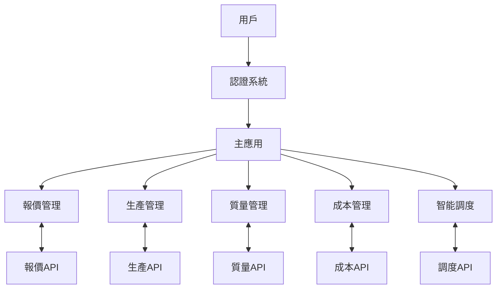

# 專案記憶庫驅動開發系統

_最後更新時間: 2024-02-25_

## 目錄

1. [目的與範圍](#目的與範圍)
2. [目錄與檔案結構](#目錄與檔案結構)
3. [套件相依性分析](#套件相依性分析)
4. [核心功能模組詳解](#核心功能模組詳解)
5. [開發規範指南](#開發規範指南)
6. [標準開發流程](#標準開發流程)
7. [記憶庫維護機制](#記憶庫維護機制)
8. [更新記錄](#更新記錄)

## 目的與範圍

本記憶庫旨在建立一個結構化的專案知識庫，使開發團隊和人工智能助手能夠快速理解程式碼基礎，最小化溝通成本，並提供高品質的開發協助。透過標準化的文檔格式與流程，確保所有開發活動均基於完整理解的專案結構進行。

記憶庫涵蓋範圍包括：

- 完整的目錄與檔案結構說明
- 套件相依性與版本管理資訊
- 核心功能模組與業務邏輯流程
- 開發規範與最佳實踐指南
- 測試策略與覆蓋情況分析

## 目錄與檔案結構

### 主要目錄層次

```
frontend/
├── docs/                      # 專案文檔
│   ├── project_structure.md   # 專案結構文檔
│   ├── project_memory.md      # 專案記憶文檔
│   └── memory_bank.md         # 專案記憶庫
├── public/                    # 靜態資源和HTML模板
├── src/                       # 源代碼
│   ├── assets/                # 靜態資源(圖片、字體等)
│   ├── components/            # React組件
│   ├── config/                # 配置文件
│   ├── hooks/                 # 自定義React鉤子
│   ├── i18n/                  # 國際化資源
│   ├── layout/                # 布局組件
│   ├── pages/                 # 頁面組件
│   ├── router/                # 路由配置
│   ├── services/              # API服務
│   ├── store/                 # 狀態管理
│   ├── styles/                # 全局樣式
│   ├── utils/                 # 工具函數
│   ├── utility/               # 實用工具
│   ├── App.js                 # 應用入口組件
│   └── index.js               # 應用入口文件
└── [配置文件]                  # 各種配置文件
```

### 關鍵目錄詳情

#### `/src/components/`

包含所有可重用的 React 組件，按功能模組分類：

| 目錄                            | 用途                     | 特殊模式或例外              |
| ------------------------------- | ------------------------ | --------------------------- |
| `/BIMVersionCompare/`           | BIM 模型版本比較功能組件 | 使用 WebGL 進行 3D 模型渲染 |
| `/CostWiseSystem/`              | 成本智能系統相關組件     | 包含數據可視化圖表          |
| `/Global/`                      | 全局共用組件             | 所有頁面共享的基礎 UI 元素  |
| `/LeaderSign/`                  | 領導簽名功能組件         | 支持手寫簽名捕獲            |
| `/Login/`                       | 用戶登錄相關組件         | 多種認證方式支持            |
| `/MachineSelect/`               | 機器選擇功能組件         | 動態加載機器列表，支援生產狀態判斷與禁止點選  |
| `/MaintenanceSystem/`           | 維護系統相關組件         | 包含排程和提醒功能          |
| `/OperatorSign/`                | 操作員簽名功能組件       | 類似 LeaderSign 但權限不同  |
| `/ProductionDetail/`            | 生產詳情顯示組件         | 多層次數據展示              |
| `/ProductionInspection/`        | 生產檢查功能組件         | 包含檢查表單和報告生成      |
| `/ProductionRecord/`            | 生產記錄功能組件         | 支持批量數據錄入            |
| `/ProductionReport/`            | 生產報告功能組件         | 支持多種格式導出            |
| `/ProductionSchedule/`          | 生產計劃功能組件         | 包含甘特圖視圖              |
| `/QualityManagementSystem/`     | 質量管理系統組件         | 整合多種質量控制工具        |
| `/QuotationManagementSystem/`   | 報價管理系統組件         | 主要報價系統界面            |
| `/QuotationManagementSystemFQ/` | 報價管理系統 FQ 版本組件 | 快速報價特殊版本            |
| `/SmsVerification/`             | 簡訊驗證功能組件         | 整合第三方簡訊服務          |
| `/WiseScheduling/`              | 智能調度功能組件         | 使用算法優化生產排程        |

#### `/src/services/`

包含所有 API 服務和數據處理邏輯：

| 目錄/文件               | 用途             | 關鍵功能                         |
| ----------------------- | ---------------- | -------------------------------- |
| `/auth/`                | 認證相關服務     | 登錄、登出、權限驗證、令牌刷新   |
| `/QuotationManagement/` | 報價管理相關服務 | 報價創建、查詢、修改、審批、導出 |
| `cacheService.js`       | 緩存服務         | 本地數據緩存、過期策略、同步機制 |

#### `/src/router/`

路由配置和懶加載組件：

| 文件                | 用途           | 特殊處理                     |
| ------------------- | -------------- | ---------------------------- |
| `AppLayout.jsx`     | 應用主布局     | 包含全局導航和側邊欄         |
| `lazyComponents.js` | 組件懶加載配置 | 使用 React.lazy 實現按需加載 |
| `routeConfig.js`    | 路由配置定義   | 包含路由權限控制和重定向規則 |

### 檔案分佈統計

| 檔案類型       | 數量 | 主要用途             |
| -------------- | ---- | -------------------- |
| .jsx/.tsx      | 未知 | React 組件           |
| .js/.ts        | 未知 | 工具函數、服務和配置 |
| .scss/.css     | 未知 | 樣式文件             |
| .json          | 未知 | 配置和靜態數據       |
| .svg/.png/.jpg | 未知 | 圖像資源             |

### 命名慣例與特殊模式

- **組件目錄**: PascalCase (例如: `ProductionDetail`)
- **組件文件**: PascalCase (例如: `Button.jsx`)
- **工具函數文件**: camelCase (例如: `formatDate.js`)
- **樣式文件**: 與組件同名，使用.scss 擴展名 (例如: `Button.scss`)
- **特殊模式**:
  - 高階組件使用`with`前綴 (例如: `withAuth.jsx`)
  - 自定義鉤子使用`use`前綴 (例如: `useFormValidation.js`)
  - 常量文件使用`constants`後綴 (例如: `apiConstants.js`)

## 套件相依性分析

### 核心套件

| 套件名稱         | 版本    | 用途     | 關鍵 API/組件                           | 配置位置                  | 使用狀態 |
| ---------------- | ------- | -------- | --------------------------------------- | ------------------------- | -------- |
| react            | ^18.2.0 | UI 庫    | useState, useEffect, Component          | package.json              | 使用中   |
| react-dom        | ^18.2.0 | DOM 渲染 | render, createPortal                    | package.json              | 使用中   |
| react-router-dom | ^6.10.0 | 路由管理 | BrowserRouter, Route, Link, useNavigate | src/router/routeConfig.js | 使用中   |

### UI 與樣式

| 套件名稱            | 版本     | 用途                   | 關鍵 API/組件           | 配置位置           | 使用狀態 |
| ------------------- | -------- | ---------------------- | ----------------------- | ------------------ | -------- |
| @mui/material       | ^5.12.2  | Material Design UI 庫  | Button, TextField, Grid | package.json       | 使用中   |
| @mui/icons-material | ^5.11.16 | Material Design 圖標庫 | AddIcon, DeleteIcon     | package.json       | 使用中   |
| @emotion/react      | ^11.10.8 | CSS-in-JS 樣式引擎     | css, keyframes          | package.json       | 使用中   |
| @emotion/styled     | ^11.10.8 | 樣式化組件             | styled                  | package.json       | 使用中   |
| sass                | ^1.62.1  | SCSS 處理              | -                       | package.json       | 使用中   |
| styled-components   | ^5.3.10  | CSS-in-JS 樣式解決方案 | styled, ThemeProvider   | package.json       | 使用中   |
| tailwindcss         | ^3.3.2   | 原子化 CSS 框架        | 通過類名應用樣式        | tailwind.config.js | 使用中   |

### 國際化

| 套件名稱      | 版本     | 用途             | 關鍵 API/組件         | 配置位置        | 使用狀態 |
| ------------- | -------- | ---------------- | --------------------- | --------------- | -------- |
| i18next       | ^22.4.15 | 國際化框架       | t, useTranslation     | src/i18n/config | 使用中   |
| react-i18next | ^12.2.0  | React 國際化整合 | useTranslation, Trans | src/i18n/config | 使用中   |

### 網絡請求

| 套件名稱 | 版本   | 用途        | 關鍵 API/組件           | 配置位置            | 使用狀態 |
| -------- | ------ | ----------- | ----------------------- | ------------------- | -------- |
| axios    | ^1.4.0 | HTTP 客戶端 | get, post, interceptors | src/services/api.js | 使用中   |

### 狀態管理

| 套件名稱    | 版本    | 用途                | 關鍵 API/組件                      | 配置位置           | 使用狀態 |
| ----------- | ------- | ------------------- | ---------------------------------- | ------------------ | -------- |
| redux       | ^4.2.1  | 狀態管理庫          | createStore, combineReducers       | src/store/index.js | 使用中   |
| react-redux | ^8.0.5  | Redux 的 React 綁定 | Provider, useSelector, useDispatch | src/store/index.js | 使用中   |
| redux-thunk | ^2.4.2  | Redux 異步中間件    | thunk                              | src/store/index.js | 使用中   |
| immer       | ^10.0.1 | 不可變數據處理      | produce                            | src/store/reducers | 使用中   |
| zustand     | ^4.5.2  | 狀態管理庫          | create, devtools                   | 各組件中           | 使用中   |

### 表單處理

| 套件名稱        | 版本    | 用途         | 關鍵 API/組件                    | 配置位置   | 使用狀態 |
| --------------- | ------- | ------------ | -------------------------------- | ---------- | -------- |
| formik          | ^2.2.9  | 表單狀態管理 | useFormik, Formik, Field         | 各表單組件 | 未使用   |
| yup             | ^1.1.1  | 表單驗證     | object, string, number, required | 各表單組件 | 使用中   |
| react-hook-form | ^7.53.0 | 表單狀態管理 | useForm, useController           | 各表單組件 | 使用中   |
| zod             | ^3.23.8 | 表單驗證     | z.object, z.string               | 各表單組件 | 使用中   |

### 圖表與可視化

| 套件名稱          | 版本     | 用途                   | 關鍵 API/組件                | 配置位置     | 使用狀態 |
| ----------------- | -------- | ---------------------- | ---------------------------- | ------------ | -------- |
| echarts           | ^5.4.2   | 數據可視化圖表         | init, setOption              | 圖表相關組件 | 使用中   |
| echarts-for-react | ^3.0.2   | ECharts 的 React 封裝  | ReactECharts                 | 圖表相關組件 | 未使用   |
| three.js          | ^0.152.2 | 3D 渲染庫              | Scene, Camera, WebGLRenderer | BIM 相關組件 | 未使用   |
| chart.js          | ^4.4.0   | 數據可視化圖表         | Chart                        | 圖表相關組件 | 使用中   |
| react-chartjs-2   | ^5.2.0   | Chart.js 的 React 封裝 | Line, Bar, Pie               | 圖表相關組件 | 使用中   |

### 工具庫

| 套件名稱   | 版本     | 用途                  | 關鍵 API/組件                 | 配置位置     | 使用狀態 |
| ---------- | -------- | --------------------- | ----------------------------- | ------------ | -------- |
| lodash     | ^4.17.21 | JavaScript 工具函數庫 | debounce, throttle, cloneDeep | 全局使用     | 使用中   |
| dayjs      | ^1.11.7  | 日期處理庫            | format, parse, add            | 全局使用     | 使用中   |
| uuid       | ^9.0.0   | 唯一 ID 生成          | v4                            | 全局使用     | 使用中   |
| crypto-js  | ^4.1.1   | 加密庫                | AES, SHA256                   | 認證相關服務 | 使用中   |
| classnames | ^2.3.2   | CSS 類名處理          | classnames                    | 全局使用     | 使用中   |
| file-saver | ^2.0.5   | 文件保存              | saveAs                        | 導出功能     | 使用中   |
| exceljs    | ^4.4.0   | Excel 文件處理        | Workbook, Worksheet           | 導出功能     | 使用中   |

### 測試工具

| 套件名稱               | 版本     | 用途           | 關鍵 API/組件              | 配置位置          | 使用狀態 |
| ---------------------- | -------- | -------------- | -------------------------- | ----------------- | -------- |
| jest                   | ^29.5.0  | 測試框架       | describe, it, expect       | jest.config.js    | 未使用   |
| @testing-library/react | ^14.0.0  | React 組件測試 | render, fireEvent, waitFor | 測試文件          | 未使用   |
| cypress                | ^12.11.0 | 端到端測試框架 | visit, get, click          | cypress.config.js | 未使用   |
| msw                    | ^1.2.1   | API 模擬       | rest, setupServer          | src/mocks         | 未使用   |

### 構建與開發工具

| 套件名稱    | 版本    | 用途           | 關鍵 API/組件  | 配置位置       | 使用狀態 |
| ----------- | ------- | -------------- | -------------- | -------------- | -------- |
| vite        | ^4.3.5  | 構建工具       | defineConfig   | vite.config.js | 未使用   |
| eslint      | ^8.39.0 | 代碼檢查工具   | rules, plugins | .eslintrc      | 使用中   |
| prettier    | ^2.8.8  | 代碼格式化工具 | -              | .prettierrc    | 使用中   |
| husky       | ^8.0.3  | Git hooks 工具 | -              | .husky         | 未使用   |
| lint-staged | ^13.2.2 | 暫存文件 lint  | -              | package.json   | 未使用   |

### 套件依賴關係圖

```mermaid
graph TD
    A[React] --> B[React DOM]
    A --> C[React Router DOM]
    A --> D1[MUI Material]
    D1 --> D2[MUI Icons]
    D1 --> D3[@emotion/react]
    D1 --> D4[@emotion/styled]
    F[Redux] --> G[React Redux]
    G --> A
    F --> H[Redux Thunk]
    F --> I[Immer]
    J[React Hook Form] --> A
    J --> K[Zod]
    L[ECharts] --> A
    M[Chart.js] --> N[react-chartjs-2]
    N --> A
    O[i18next] --> P[react-i18next]
    P --> A
    Q[axios] --> R[API Services]
    R --> A
    S[styled-components] --> A
    T[zustand] --> A
    U[tailwindcss] -.-> A
    V[工具庫] -.-> A
    V --> W[lodash]
    V --> X[dayjs]
    V --> Y[uuid]
    V --> Z[crypto-js]
    V --> AA[classnames]
    V --> AB[file-saver]
    V --> AC[exceljs]
```

### 未使用套件說明

以下套件已下載但目前未在專案中實際使用：

1. **formik** - 專案使用 react-hook-form 進行表單管理，formik 可能是早期選型或備選方案
2. **echarts-for-react** - 專案直接使用 echarts 或改用 chart.js+react-chartjs-2
3. **three.js** - BIM 相關功能可能尚未實現或使用其他技術實現
4. **測試工具** (jest, @testing-library/react, cypress, msw) - 測試框架已配置但可能尚未編寫測試用例
5. **vite** - 專案使用 react-scripts (Create React App)進行構建，vite 可能是計劃中的遷移目標
6. **husky & lint-staged** - Git hooks 工具已安裝但可能未配置使用

這些未使用的套件可以考慮在未來版本中移除，以減少專案依賴和構建大小。

### 環境配置

| 配置類型 | 位置                   | 關鍵參數                      | 說明                   |
| -------- | ---------------------- | ----------------------------- | ---------------------- |
| 套件配置 | package.json           | dependencies, scripts         | 定義所有套件依賴和命令 |
| 環境變量 | .env, .env.production  | VITE_API_URL, VITE_APP_ENV    | 環境特定的配置參數     |
| 構建配置 | vite.config.js         | plugins, resolve.alias        | Vite 構建工具配置      |
| 代碼風格 | .eslintrc, .prettierrc | rules, plugins                | 代碼格式和風格規則     |
| 測試配置 | jest.config.js         | testMatch, setupFilesAfterEnv | Jest 測試框架配置      |
| 類型檢查 | tsconfig.json          | compilerOptions, include      | TypeScript 配置        |

## 核心功能模組詳解

### 主要功能模組

| 模組名稱 | 主要功能                   | 關鍵組件                                                                     | API 服務                 | 測試覆蓋 |
| -------- | -------------------------- | ---------------------------------------------------------------------------- | ------------------------ | -------- |
| 認證系統 | 用戶登錄、簡訊驗證         | Login, SmsVerification                                                       | auth 服務                | 未知     |
| 報價管理 | 報價創建、查詢、修改、刪除 | QuotationManagementSystem                                                    | QuotationManagement 服務 | 未知     |
| 生產管理 | 生產計劃、記錄、報告、檢查 | ProductionSchedule, ProductionRecord, ProductionReport, ProductionInspection | 未知                     | 未知     |
| 質量管理 | 質量控制與管理             | QualityManagementSystem                                                      | 未知                     | 未知     |
| 成本管理 | 成本分析與智能管理         | CostWiseSystem                                                               | 未知                     | 未知     |
| 智能調度 | 生產調度優化               | WiseScheduling                                                               | 未知                     | 未知     |

### 模組互動流程



### 核心業務邏輯路徑

#### 認證流程

1. 用戶輸入帳號密碼
2. 發送登錄請求到認證 API
3. 獲取並存儲認證 Token
4. 重定向到主應用

#### 報價管理流程

1. 獲取報價列表
2. 創建/編輯報價單
3. 提交報價數據
4. 更新報價列表

### API 接口規範

#### 認證 API

```json
// 登錄請求
POST /api/auth/login
{
  "username": "string",
  "password": "string"
}

// 登錄響應
{
  "token": "string",
  "user": {
    "id": "string",
    "name": "string",
    "role": "string"
  }
}
```

#### 報價管理 API

```json
// 獲取報價列表
GET /api/quotations?page=1&limit=10

// 創建報價
POST /api/quotations
{
  "customer": "string",
  "items": [
    {
      "product": "string",
      "quantity": "number",
      "price": "number"
    }
  ],
  "totalAmount": "number"
}
```

### 實作模式與設計模式

- **組件結構**: 容器組件 + 展示組件模式
- **狀態管理**: 
  - 局部狀態使用 useState
  - 跨組件狀態使用 Context API 或 Redux
  - 輕量级共享狀態使用 Zustand如MachineSelect的機台選擇存儲
- **API 調用**: 
  - 服務層封裝，組件通過服務層訪問 API
  - 使用 RTK Query 進行数据獲取與緩存
  - API錯誤處理統一在放置在interceptors中
- **路由管理**: 集中式路由配置，懶加載組件
- **特殊交互模式**:
  - 狀態控制層: 如MachineSelect中機台狀態常量化管理
  - 封鎖模式: 禁止點選的功能实現
  - 可視化狀態反饋: 使用CSS與樣式變量提供清晰的視覺提示
- **設計模式**:
  - 工廠模式: 用於創建複雜對象
  - 觀察者模式: 用於事件處理
  - 策略模式: 用於表單驗證
  - 裝飾器模式: 用於高階組件

## 開發規範指南

### 命名慣例

| 元素   | 命名規則          | 示例                                      |
| ------ | ----------------- | ----------------------------------------- |
| 組件   | PascalCase        | `ProductDetail.jsx`                       |
| 函數   | camelCase         | `formatCurrency()`                        |
| 常量   | UPPER_SNAKE_CASE  | `MAX_RETRY_COUNT`                         |
| 變量   | camelCase         | `userData`                                |
| CSS 類 | kebab-case 或 BEM | `button-primary` 或 `button__icon--large` |

### 架構原則

1. **組件化**: 所有 UI 元素應封裝為可重用組件
2. **關注點分離**:
   - 組件負責 UI 渲染
   - 服務負責 API 調用和數據處理
   - 工具函數負責通用邏輯
3. **狀態管理**:
   - 局部狀態使用 useState
   - 跨組件狀態使用 Context 或 Redux
   - 輕量級共享狀態使用 Zustand
4. **交互模式標準**:
   - 物件狀態組件（如機台）應使用狀態常量進行標準化管理
   - 非可交互元素應提供清晰的視覺反饋及限制（使用cursor、樣式和裝飾器）
   - 狀態變更時應有適當的輸入限制和修飾器
5. **路由管理**:
   - 集中式路由配置
   - 懶加載頁面組件

### 測試策略

- **單元測試**: 針對工具函數和獨立組件
  - 使用 Jest 和 React Testing Library
  - 測試覆蓋率目標: 70%以上
- **集成測試**: 針對複雜組件和業務流程
  - 使用 Cypress 或類似工具
  - 關注關鍵用戶流程
- **測試文件位置**: 與被測試代碼同目錄下的`__tests__`目錄
- **測試命名**: `[被測試文件名].test.js`

### 代碼質量標準

- **複雜度閾值**: 循環複雜度不超過 10
- **函數長度**: 不超過 50 行
- **文件長度**: 不超過 500 行
- **註釋要求**: 所有公共 API 和複雜邏輯必須有註釋
- **代碼審查**: 所有 PR 必須至少有一個審查者批准

### 代碼示例

#### 組件結構示例

```jsx
// 標準組件結構
import React, { useState, useEffect } from "react";
import PropTypes from "prop-types";
import "./ComponentName.scss";

const ComponentName = ({ prop1, prop2 }) => {
  const [state, setState] = useState(initialState);

  useEffect(() => {
    // 副作用處理
  }, [dependencies]);

  const handleEvent = () => {
    // 事件處理
  };

  return <div className="component-name">{/* JSX結構 */}</div>;
};

ComponentName.propTypes = {
  prop1: PropTypes.string.isRequired,
  prop2: PropTypes.number,
};

ComponentName.defaultProps = {
  prop2: 0,
};

export default ComponentName;
```

#### 狀態管理的組件示例

```jsx
// MachineSelect組件狀態管理示例

// 狀態常量定義
const MACHINE_STATUS = {
  ACTIVE: 'active',     // 正在生產
  IDLE: null,           // 待機，可開始新生產
  DISABLED: 'disabled'  // 尚未生產，禁止點選
};

// 機台狀態處理邏輯
const processStatus = (machineData, productionData) => {
  return machineData.map(machine => {
    // 檢查機台是否在生產中
    const isActive = productionData.some(
      productionMachine => productionMachine.machineSN === machine.machineSN
    );
    
    if (isActive) {
      return { ...machine, status: MACHINE_STATUS.ACTIVE, isClickable: true };
    } else {
      return { ...machine, status: MACHINE_STATUS.DISABLED, isClickable: false };
    }
  });
};

// 渲染機台項目
const renderMachineItem = (machine, handleClick) => (
  <div
    className={`machine-box ${machine.status}`}
    onClick={() => machine.isClickable && handleClick(machine)}
    style={{ cursor: machine.isClickable ? 'pointer' : 'not-allowed' }}
  >
    <h1>{machine.machineSN}</h1>
    {machine.status === MACHINE_STATUS.ACTIVE ? (
      <p>生產中...</p>
    ) : (
      <>
        <p>無生產任務</p>
        <p className="disabled-message">此機台目前無法選擇</p>
      </>
    )}
  </div>
);
```

#### 服務層示例

```js
// API服務示例
import axios from "axios";
import { API_BASE_URL } from "../config/constants";

const apiClient = axios.create({
  baseURL: API_BASE_URL,
});

// 請求攔截器
apiClient.interceptors.request.use((config) => {
  const token = localStorage.getItem("token");
  if (token) {
    config.headers.Authorization = `Bearer ${token}`;
  }
  return config;
});

export const fetchData = async (endpoint, params) => {
  try {
    const response = await apiClient.get(endpoint, { params });
    return response.data;
  } catch (error) {
    console.error("API Error:", error);
    throw error;
  }
};

export const postData = async (endpoint, data) => {
  try {
    const response = await apiClient.post(endpoint, data);
    return response.data;
  } catch (error) {
    console.error("API Error:", error);
    throw error;
  }
};
```

## 標準開發流程

### 功能開發流程

1. **需求分析**

   - 閱讀並理解需求文檔
   - 確認功能範圍和驗收標準
   - 識別潛在的技術挑戰

2. **設計階段**

   - 將需求分解為明確的功能組件
   - 規劃詳細的檔案結構變更
   - 設計組件層次結構和數據流
   - 確認與現有架構的一致性

3. **實現階段**

   - 按照設計創建必要的文件和組件
   - 實現核心功能邏輯
   - 添加適當的錯誤處理和邊界情況
   - 確保代碼符合項目風格指南

4. **測試階段**

   - 為新功能編寫單元測試
   - 進行手動功能測試
   - 確保所有測試通過

5. **文檔更新**
   - 更新記憶庫文件
   - 添加必要的代碼註釋
   - 更新用戶文檔(如適用)

### 記憶庫使用流程

1. 每次開發活動開始前，閱讀最新的記憶庫文件
2. 根據記憶庫中的架構原則和模式進行設計
3. 參考相似功能的實現方式和最佳實踐
4. 開發完成後更新記憶庫，反映新增內容

## 記憶庫維護機制

### 更新觸發條件

記憶庫應在以下情況下更新：

1. 新功能或模組添加
2. 現有功能重大修改
3. 依賴關係變更
4. 架構調整
5. 開發規範變更

### 更新內容要求

當添加新功能或修改現有結構時，記憶庫必須同步更新：

- 記錄功能拆解與新增檔案位置
- 更新變動的目錄結構說明
- 檢視並更新相依關係變更
- 補充測試覆蓋範圍資訊
- 註明任何偏離既有模式的情況

### 技術債務追蹤

| 問題描述 | 位置 | 影響範圍 | 優先級 | 解決方案 |
| -------- | ---- | -------- | ------ | -------- |
| 待添加   | -    | -        | -      | -        |

## 更新記錄

### 更新功能: MachineSelect組件機台禁止點選功能

- 位置: /src/components/MachineSelect/index.jsx, /src/components/MachineSelect/index.scss
- 描述: 優化MachineSelect組件，對非生產中機台實現禁止點選功能，包括視覺反饋與交互限制
- 依賴: React, antd, zustand
- 添加時間: 2025-02-25
- 修改要點:
  - 添加機台狀態類型常量(ACTIVE/IDLE/DISABLED)進行標準化管理
  - 實現非生產中機台的禁止點選交互邏輯
  - 優化CSS樣式，為禁用狀態添加視覺反饋
  - 重構組件代碼，按照Airbnb風格指南進行分層與註釋

### 更新功能: 專案記憶庫驅動開發系統

- 位置: /docs/memory_bank.md
- 描述: 根據專案記憶庫驅動開發協議重新組織專案知識庫，優化結構和內容
- 依賴: 無
- 添加時間: 2024-02-25

### 更新功能: 專案記憶庫重構

- 位置: /docs/memory_bank.md
- 描述: 根據專案記憶庫協議重新組織專案知識庫，優化結構和內容
- 依賴: 無
- 添加時間: 2024-02-25

### 更新功能: 專案知識庫擴展

- 位置: /docs/memory_bank.md
- 描述: 擴展專案知識庫為完整的專案知識庫驅動開發系統
- 依賴: 無
- 添加時間: 2024-02-25

### 更新功能: 專案知識庫翻譯

- 位置: /docs/memory_bank.md
- 描述: 將專案知識庫內容翻譯成繁體中文
- 依賴: 無
- 添加時間: 2024-02-25

### 新增功能: 專案知識庫

- 位置: /docs/memory_bank.md
- 描述: 創建專案知識庫，包含完整資料夾結構、模組功能和接口、程式碼依賴關係、測試覆蓋情況
- 依賴: 無
- 添加時間: 2024-02-25

### 新增功能: 專案記憶文檔

- 位置: /docs/project_memory.md
- 描述: 創建專案記憶文檔，包含更詳細的專案結構、功能模組、API 接口、組件依賴關係和配置信息
- 依賴: 無
- 添加時間: 2024-02-25

### 新增功能: 專案結構文檔

- 位置: /docs/project_structure.md
- 描述: 創建專案結構文檔，包含專案的資料夾結構、功能模組和接口規範
- 依賴: 無
- 添加時間: 2024-02-25
